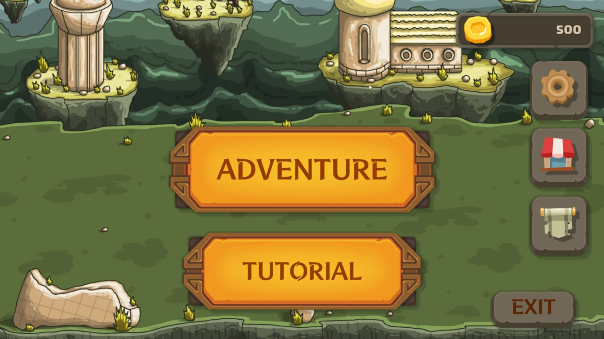
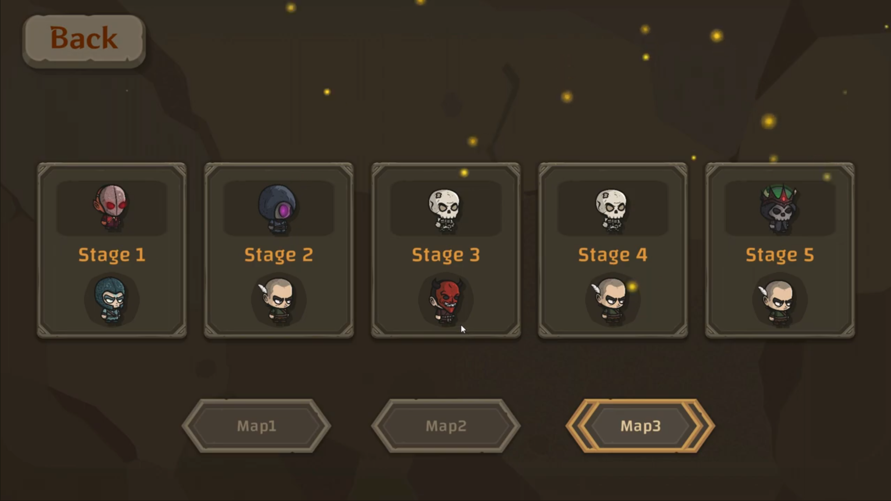
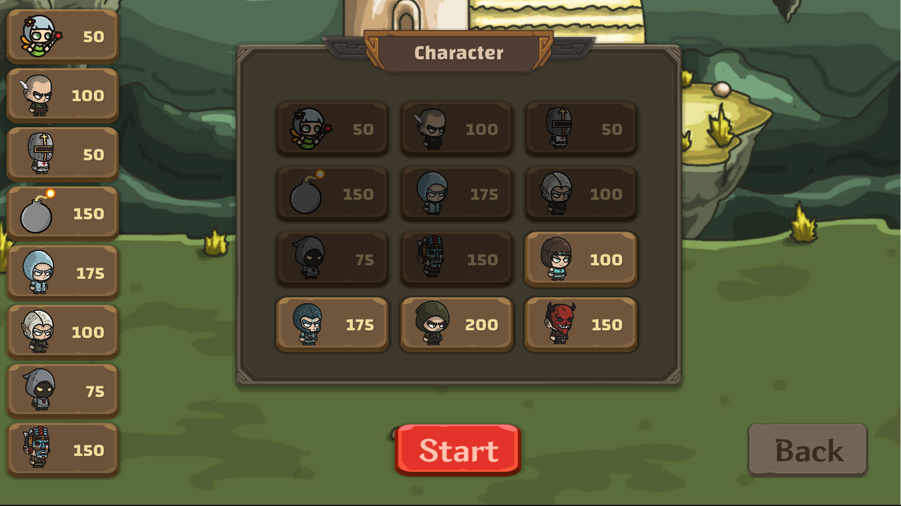
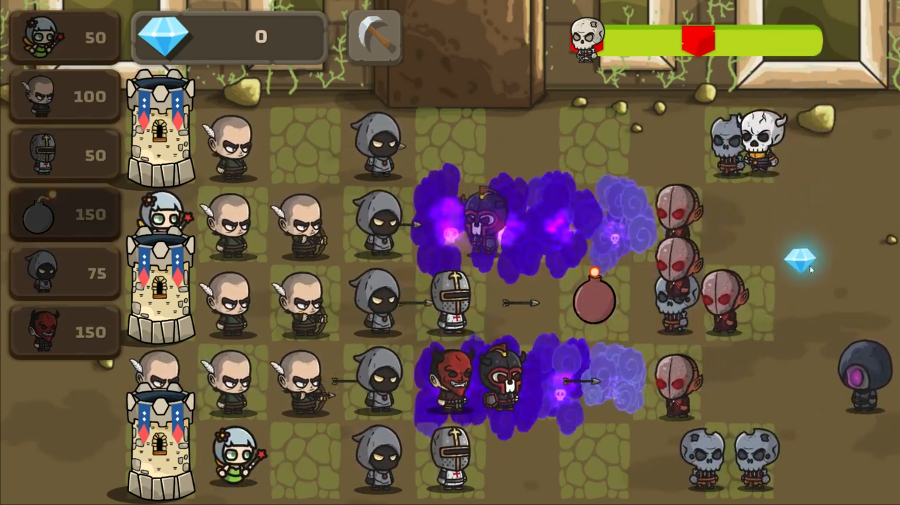

# Tower On The Hill

* 게임 Plants vs. Zombies의 게임 시스템에 롤의 포탑 요소(억제기 역할)를 추가한 게임입니다.
* 12종의 캐릭터, 9종의 몬스터가 있습니다.
* 스테이지를 클리어할 시 조건에 따라 새로운 캐릭터가 해금됩니다.
* 총 3개의 맵, 15개의 스테이지로 구성되어 있습니다.
* 스테이지는 점점 난이도가 높아지며, 맨 마지막 스테이지는 보스전입니다.   
* 게임 플레이를 통해 코인을 모으고, 상점에서 코인으로 캐릭터 업그레이드/아이템 구매가 가능합니다.

 

## 플레이 영상
[플레이 영상 링크](https://youtu.be/0xGrBqQ2XVQ&t=11s)

 

## 팀원
| 이름 | 포지션 | 주요 구현 사항 |
|--------|--------|--------|
| [김유경](https://github.com/YOUKK) | 팀장, 클라이언트 | UI 기능, 해금 시스템 |
| [이동규](https://github.com/Dong-kyu-Lee) | 클라이언트 | 몬스터, 상점 |
| [이환률](https://github.com/Djklsfj-Ryul) | 클라이언트 | 캐릭터, 튜토리얼 |

 

## 스크린샷

